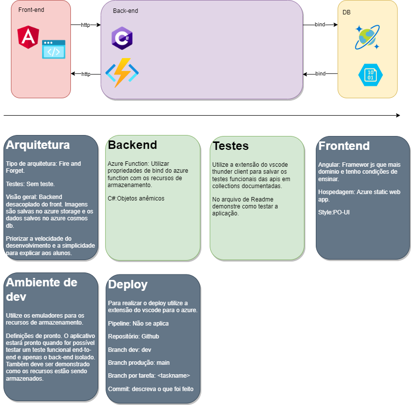

# Levitas

A levitas é um projeto social que tem como missão promover a cultura do skate por meio de aulas, eventos e competições.

## Aplicativo para controle gerencial

## Arquitetura

Esse projeto foi arquitetado para fácil entendimento no processo de aprendizagem de aplicativos nativos para nuvem.

Estamos utilizando o que há de mais moderno em tecnologias de armazenamento como o Azure Storage Accoount e o Azure Cosmos DB,
nosso back end está hospedado no Azure Function e monitorado pelo
Azure Application Insights e o front end no Azure Static Web App.

Todas ferramentas desenvolvidas pela microsoft e que nos ajuda a criar aplicativos rapidamente e com segurança.



## Objetivo

O objetivo desse aplicativo é fornecer a melhor gestão para o projeto social, desde o cadastro de alunos a captação de recursos financeiros.
Durante o desenolvimento serão feitas sessões de entendimento das necessidades com o time, levantamento de requisitos e será coberto o básico sobre gestão ágil de projetos.

O Roadmap de entregas pode ser acompanhado aqui: [Trello](https://trello.com/b/kflQvLKE/levitascadastro-de-alunos)

## Requisitos para rodar a aplicação na máquina

Para rodar esse aplicativo na sua máquina você precisa de:

- [Dotnet](https://dotnet.microsoft.com/en-us/download/dotnet/6.0)
- [Vscode](https://code.visualstudio.com/Download)
- [Node](https://nodejs.org/en)
- [Angular](https://angular.io/cli)
- [Azurite](https://learn.microsoft.com/en-us/azure/storage/common/storage-use-azurite?tabs=visual-studio)
- [Azure Cosmo Db Emulator](https://learn.microsoft.com/en-us/azure/cosmos-db/local-emulator?tabs=ssl-netstd21)
- [Git](https://git-scm.com/)

## Como rodar a aplicação

- Com tudo instalado
- Inicie o Azure Cosmos Db Emulator
- Faça uma cópia do repositório na sua máquina.
- Abra o projeto pelo vscode.
- Abra o terminal integrado do vscode.
- Navegue até a pasta do azurite e inicie o serviço:

```CMD
cd api/levitas/azurite
azurite -l
```

- Abra uma nova aba do terminal integrado
- Navegue até a pasta do backend e inicie o serviço:

```CMD
cd api/levitas
func host start --cors *
```

- Abra uma nova aba do terminal integrado
- Navegue até a pasta do frontend e inicie o serviço:

```CMD
cd app
ng s -o
```
